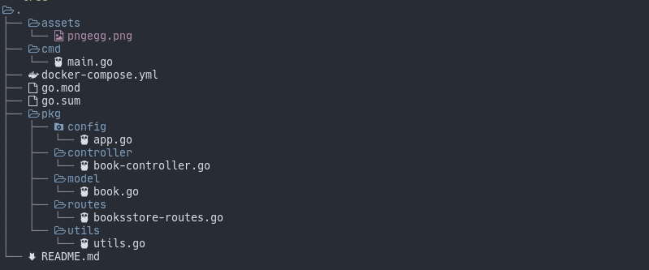

  

## Go api simple project

This project was only to learn how to make a crud api from scratch with the go language.

Structure of the code is as follows

  

To run the project locally follow these steps

1. Clone the project `git clone https://github.com/Abeldlp/go-api.git`
2. Install dependencies `go mod tidy`
3. Run a docker container with the database `docker-compose up -d`
4. Run the server `cd cmd && go run main.go`

Those steps assume that you have docker / docker-compose installed alongside go
If you do not, install [go](https://go.dev/doc/install), [docker](https://docs.docker.com/get-docker/) and [docker-compose](https://docs.docker.com/compose/install/)
Otherwise feel free to change the config in `config/app.go`

  

